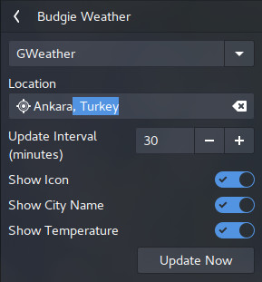
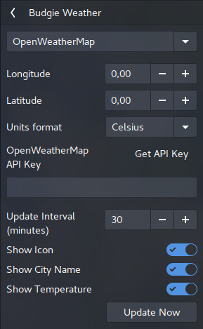

# Budgie Weather
A weather applet for Budgie Desktop. OpenWeatherMap is used for getting weather data.  

  

### Gweather Settings
  

### OpenWeatherMap Settings
  

---

## Dependencies
```
budgie-1.0 >= 2
gnome-desktop-3.0
gtk+-3.0 >= 3.18
glib-2.0
libpeas-1.0 >= 1.8.0
vala
libsoup-2.4
gweather-3.0
json-glib-1.0
systemd-logind (optional, to update weather data after waking from suspend)
```

### Installing

**From source**  
```bash
mkdir build && cd build
meson --prefix /usr --buildtype=plain ..
ninja
sudo ninja install
```

### License
This program is free software; you can redistribute it and/or modify it under the terms of the GNU General Public License as published by the Free Software Foundation; either version 2 of the License, or at your option) any later version.

Workspaces applet of Budgie Desktop is used as a templete for this project. Spacer applet used as a templete in implementing settings.
